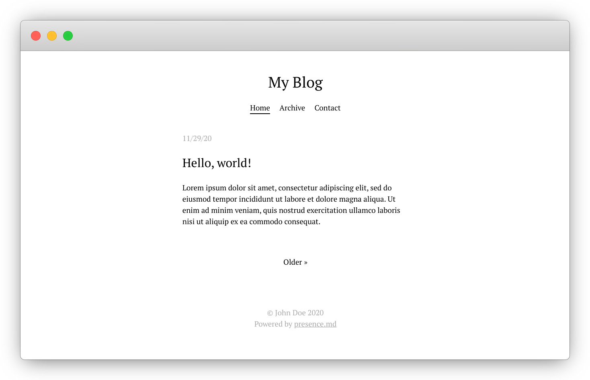

# presence.md

**presence.md** is a tiny HTTP server that generates a minimalistic, mobile-friendly blog from a collection of Markdown files. It makes publishing a post as simple as dropping a file in a directory.

<p align="center">
  
</p>

## Features

* In-memory store of articles, updated on file system events
* CommonMark-compliant
* Syntax highlighting for code blocks
* Gzip compression
* TLS support
* RSS feed

## Installation

Make sure [Go](https://golang.org/) is installed on your system.

```
git clone https://github.com/climech/presence.md.git
cd presence.md/
make test  # optional
make && sudo make install
```

Copy the example configuration:

```
cp -r config/ ~/.config/presence
```

## Configuration

Refer to the self-documented `config.yml` in the example configuration.

## Usage

To start the server, run `presence` in your terminal.

### Create a new post

Create a new Markdown document somewhere on your system with a URL-friendly filename, e.g. `words-separated-by-dashes.md`. The valid characters are: a-z, A-Z, 0-9, dashes and underscores.

```
# Hello world!

This is a blog post.
```

Place the file inside `posts_dir` defined in your `config.yml`. The file will be immediately renamed to include the current Unix timestamp and loaded into the store. The title is extracted from the top-level heading if present.

### Create a page

Documents placed in `pages_dir` will appear in the site's navigation bar. The timestamp part is only used for sorting here, and can be set to arbitrary values, e.g. `projects.1.md`, `contact.2.md`, etc.

-----
© 2020 climech.org